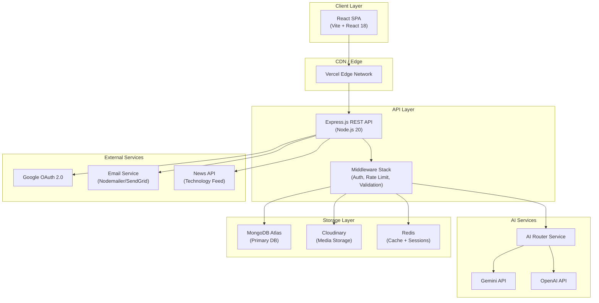
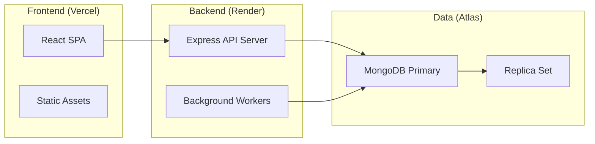
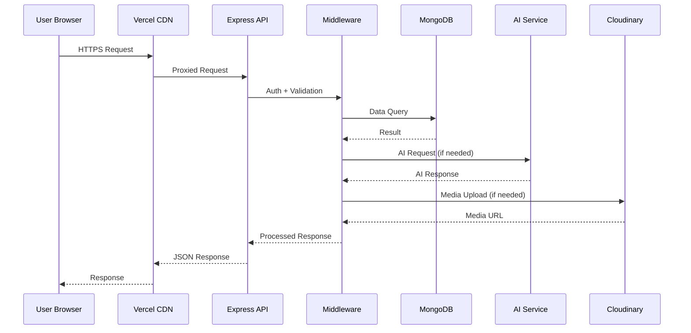

    # Design Document: LMS Coursemate 2.0

## Overview

LMS Coursemate 2.0 is a production-ready, AI-powered Student Success Ecosystem built as a SaaS platform. It combines learning management, AI tutoring, career development, placement preparation, industry analytics, community features, and gamification into a single cohesive product — designed to feel like a fusion of Moodle, Coursera, LinkedIn Learning, Duolingo, Notion, and ChatGPT.

The platform serves three primary roles: Students (learning, career growth, placement prep), Teachers (course creation, student analytics, AI-assisted content generation), and Admins (platform governance, analytics, content moderation). The architecture is a decoupled React SPA frontend communicating with a Node.js/Express REST API backend, backed by MongoDB Atlas, with AI capabilities powered by Gemini/OpenAI APIs and media storage via Cloudinary.

The system is designed for horizontal scalability, multi-tenancy readiness, and a premium SaaS user experience with glassmorphism UI, dark/light mode, smooth animations, and real-time features.

## Architecture

### High-Level System Architecture



### Deployment Architecture



### Request Flow



## Components and Interfaces

### Component 1: Authentication Service

**Purpose**: Handles user registration, login, JWT issuance, Google OAuth, email verification, and role-based access control.

**Interface**:
```typescript
interface IAuthService {
  register(data: RegisterDTO): Promise<AuthResponse>
  login(data: LoginDTO): Promise<AuthResponse>
  googleOAuth(token: string): Promise<AuthResponse>
  verifyEmail(token: string): Promise<void>
  forgotPassword(email: string): Promise<void>
  resetPassword(token: string, newPassword: string): Promise<void>
  refreshToken(refreshToken: string): Promise<TokenPair>
  logout(userId: string): Promise<void>
}

interface AuthResponse {
  user: UserPublicProfile
  accessToken: string
  refreshToken: string
}

interface TokenPair {
  accessToken: string
  refreshToken: string
}
```

**Responsibilities**:
- Issue short-lived JWT access tokens (15 min) and long-lived refresh tokens (7 days)
- Validate Google OAuth ID tokens via Google's public keys
- Send email verification and password reset links with signed tokens
- Enforce role-based access: `admin`, `teacher`, `student`

---

### Component 2: Course Management Service

**Purpose**: Full lifecycle management of courses, chapters, lessons, and associated media.

**Interface**:
```typescript
interface ICourseService {
  createCourse(data: CreateCourseDTO, teacherId: string): Promise<Course>
  updateCourse(courseId: string, data: UpdateCourseDTO): Promise<Course>
  deleteCourse(courseId: string): Promise<void>
  publishCourse(courseId: string): Promise<Course>
  enrollStudent(courseId: string, studentId: string): Promise<Enrollment>
  getCourseWithProgress(courseId: string, userId: string): Promise<CourseWithProgress>
  searchCourses(query: SearchQuery): Promise<PaginatedResult<Course>>
  getRecommendedCourses(userId: string): Promise<Course[]>
}

interface CreateCourseDTO {
  title: string
  description: string
  category: string
  level: 'beginner' | 'intermediate' | 'advanced'
  price: number
  thumbnail: string
  tags: string[]
}
```

**Responsibilities**:
- Manage course CRUD with soft-delete
- Handle enrollment and progress tracking
- Trigger AI content generation on upload
- Compute course completion percentages

---

### Component 3: AI Orchestration Service

**Purpose**: Routes AI requests to appropriate models, manages prompts, handles rate limiting, and caches responses.

**Interface**:
```typescript
interface IAIService {
  generateCourseContent(file: Buffer, fileType: string): Promise<GeneratedCourse>
  askTutor(question: string, context: CourseContext): Promise<TutorResponse>
  generateLearningPath(goal: LearningGoal): Promise<LearningPath>
  simulateInterview(role: string, question: string, answer: string): Promise<InterviewFeedback>
  analyzeResume(resumeText: string, targetRole: string): Promise<ResumeAnalysis>
  predictPerformance(studentData: StudentMetrics): Promise<PerformancePrediction>
  generateProjectIdeas(domain: string, level: string): Promise<ProjectIdea[]>
}

interface CourseContext {
  courseId: string
  chapterId?: string
  previousMessages: Message[]
}

interface TutorResponse {
  answer: string
  examples: string[]
  relatedTopics: string[]
  followUpQuestions: string[]
}
```

**Responsibilities**:
- Abstract Gemini/OpenAI behind a unified interface
- Implement prompt engineering templates per feature
- Cache frequent AI responses in Redis
- Track AI usage per user for rate limiting

---

### Component 4: Quiz & Assessment Engine

**Purpose**: Creates, delivers, auto-evaluates quizzes and assignments with leaderboard and analytics.

**Interface**:
```typescript
interface IQuizService {
  createQuiz(data: CreateQuizDTO): Promise<Quiz>
  startAttempt(quizId: string, userId: string): Promise<QuizAttempt>
  submitAnswer(attemptId: string, questionId: string, answer: string): Promise<void>
  submitQuiz(attemptId: string): Promise<QuizResult>
  getLeaderboard(quizId: string): Promise<LeaderboardEntry[]>
  getAnalytics(quizId: string): Promise<QuizAnalytics>
}

interface QuizResult {
  score: number
  percentage: number
  timeTaken: number
  correctAnswers: number
  wrongAnswers: number
  xpEarned: number
  passed: boolean
  detailedResults: QuestionResult[]
}
```

---

### Component 5: Gamification Engine

**Purpose**: Manages XP points, levels, badges, streaks, and leaderboards across the platform.

**Interface**:
```typescript
interface IGamificationService {
  awardXP(userId: string, action: XPAction, metadata?: object): Promise<XPResult>
  checkAndAwardBadges(userId: string): Promise<Badge[]>
  updateStreak(userId: string): Promise<StreakResult>
  getLeaderboard(scope: 'global' | 'course' | 'weekly'): Promise<LeaderboardEntry[]>
  getUserStats(userId: string): Promise<GamificationStats>
}

type XPAction =
  | 'lesson_complete'
  | 'quiz_pass'
  | 'assignment_submit'
  | 'streak_maintain'
  | 'course_complete'
  | 'community_post'
  | 'interview_practice'

interface XPResult {
  xpAwarded: number
  totalXP: number
  newLevel?: number
  leveledUp: boolean
}
```

---

### Component 6: Certificate Service

**Purpose**: Auto-generates PDF certificates with QR verification codes and unique IDs.

**Interface**:
```typescript
interface ICertificateService {
  generateCertificate(userId: string, courseId: string): Promise<Certificate>
  verifyCertificate(certificateId: string): Promise<CertificateVerification>
  downloadCertificate(certificateId: string): Promise<Buffer>
}

interface Certificate {
  id: string
  uniqueId: string
  userId: string
  courseId: string
  courseName: string
  studentName: string
  issuedAt: Date
  qrCode: string
  pdfUrl: string
}
```

---

### Component 7: Placement Hub Service

**Purpose**: Manages resume builder, mock interviews, aptitude tests, GD topics, and company prep materials.

**Interface**:
```typescript
interface IPlacementService {
  buildResume(userId: string, data: ResumeData): Promise<Resume>
  analyzeResume(resumeFile: Buffer): Promise<ResumeAnalysis>
  startMockInterview(userId: string, role: string): Promise<InterviewSession>
  submitInterviewAnswer(sessionId: string, answer: string): Promise<InterviewFeedback>
  getAptitudeTest(category: string): Promise<AptitudeTest>
  getCompanyPrep(company: string): Promise<CompanyPrepKit>
}
```

## Data Models

### User Model

```typescript
interface User {
  _id: ObjectId
  name: string
  email: string                          // unique, indexed
  password: string                       // bcrypt hashed
  avatar: string                         // Cloudinary URL
  role: 'admin' | 'teacher' | 'student'
  googleId?: string
  isEmailVerified: boolean
  emailVerificationToken?: string
  passwordResetToken?: string
  passwordResetExpires?: Date
  bio?: string
  skills: string[]
  socialLinks: {
    linkedin?: string
    github?: string
    portfolio?: string
  }
  gamification: {
    xp: number
    level: number
    streak: number
    lastActiveDate: Date
    badges: ObjectId[]
  }
  preferences: {
    theme: 'dark' | 'light'
    notifications: NotificationPreferences
    learningGoal?: string
  }
  createdAt: Date
  updatedAt: Date
}
```

**Validation Rules**:
- `email` must be unique and valid format
- `password` minimum 8 characters, hashed before storage
- `role` defaults to `student`
- `xp` and `level` are non-negative integers

---

### Course Model

```typescript
interface Course {
  _id: ObjectId
  title: string                          // indexed for search
  slug: string                           // unique URL-friendly
  description: string
  shortDescription: string
  thumbnail: string                      // Cloudinary URL
  previewVideo?: string
  instructor: ObjectId                   // ref: User
  category: ObjectId                     // ref: Category
  tags: string[]
  level: 'beginner' | 'intermediate' | 'advanced'
  language: string
  price: number
  discountPrice?: number
  currency: string
  status: 'draft' | 'published' | 'archived'
  chapters: ObjectId[]                   // ref: Chapter
  enrollmentCount: number
  rating: {
    average: number
    count: number
  }
  requirements: string[]
  outcomes: string[]
  totalDuration: number                  // minutes
  totalLessons: number
  certificate: boolean
  aiGenerated: boolean
  createdAt: Date
  updatedAt: Date
}
```

---

### Chapter & Lesson Models

```typescript
interface Chapter {
  _id: ObjectId
  courseId: ObjectId
  title: string
  description?: string
  order: number
  lessons: ObjectId[]
  isLocked: boolean
  aiSummary?: string
  createdAt: Date
}

interface Lesson {
  _id: ObjectId
  chapterId: ObjectId
  courseId: ObjectId
  title: string
  type: 'video' | 'pdf' | 'text' | 'quiz' | 'assignment'
  content: {
    videoUrl?: string
    duration?: number
    pdfUrl?: string
    textContent?: string
    quizId?: ObjectId
    assignmentId?: ObjectId
  }
  order: number
  isFree: boolean
  aiNotes?: string
  aiFlashcards?: Flashcard[]
  resources: Resource[]
  createdAt: Date
}
```

### Quiz & Question Models

```typescript
interface Quiz {
  _id: ObjectId
  courseId: ObjectId
  lessonId?: ObjectId
  title: string
  description?: string
  questions: ObjectId[]
  settings: {
    timeLimit: number                    // minutes, 0 = unlimited
    passingScore: number                 // percentage
    shuffleQuestions: boolean
    shuffleOptions: boolean
    showResults: 'immediately' | 'after_deadline' | 'never'
    maxAttempts: number
  }
  xpReward: number
  createdAt: Date
}

interface Question {
  _id: ObjectId
  quizId: ObjectId
  type: 'mcq' | 'true_false' | 'subjective' | 'fill_blank'
  question: string
  options?: string[]
  correctAnswer: string | string[]
  explanation?: string
  marks: number
  difficulty: 'easy' | 'medium' | 'hard'
  aiGenerated: boolean
}

interface QuizAttempt {
  _id: ObjectId
  quizId: ObjectId
  userId: ObjectId
  answers: Map<string, string>           // questionId -> answer
  startedAt: Date
  submittedAt?: Date
  score?: number
  percentage?: number
  passed?: boolean
  timeTaken?: number
  status: 'in_progress' | 'submitted' | 'evaluated'
}
```

---

### Enrollment & Progress Models

```typescript
interface Enrollment {
  _id: ObjectId
  userId: ObjectId
  courseId: ObjectId
  enrolledAt: Date
  completedAt?: Date
  progress: number                       // 0-100 percentage
  lastAccessedAt: Date
  completedLessons: ObjectId[]
  certificateId?: ObjectId
  status: 'active' | 'completed' | 'dropped'
}

interface LessonProgress {
  _id: ObjectId
  userId: ObjectId
  lessonId: ObjectId
  courseId: ObjectId
  completed: boolean
  completedAt?: Date
  watchTime?: number                     // seconds for video
  notes?: string
}
```

---

### AI Interview & Resume Models

```typescript
interface InterviewSession {
  _id: ObjectId
  userId: ObjectId
  role: string
  type: 'technical' | 'hr' | 'behavioral' | 'system_design'
  questions: InterviewQuestion[]
  answers: InterviewAnswer[]
  overallScore?: number
  feedback?: string
  strengths?: string[]
  improvements?: string[]
  status: 'active' | 'completed'
  startedAt: Date
  completedAt?: Date
}

interface ResumeAnalysis {
  _id: ObjectId
  userId: ObjectId
  atsScore: number                       // 0-100
  skillsFound: string[]
  skillsGap: string[]
  keywordSuggestions: string[]
  sectionFeedback: Record<string, string>
  overallFeedback: string
  improvedVersion?: string
  analyzedAt: Date
}
```

### Notification & Analytics Models

```typescript
interface Notification {
  _id: ObjectId
  userId: ObjectId
  type: 'assignment_due' | 'course_update' | 'quiz_result' | 'badge_earned' | 'announcement'
  title: string
  message: string
  link?: string
  isRead: boolean
  createdAt: Date
}

interface UserAnalytics {
  _id: ObjectId
  userId: ObjectId
  date: Date                             // daily snapshot
  learningTime: number                   // minutes
  lessonsCompleted: number
  quizzesTaken: number
  averageQuizScore: number
  xpEarned: number
  loginCount: number
}
```

---

## Algorithmic Pseudocode

### Algorithm 1: AI Course Content Generator

```pascal
ALGORITHM generateCourseFromFile(file, fileType, teacherId)
INPUT: file (Buffer), fileType (string), teacherId (ObjectId)
OUTPUT: generatedCourse (GeneratedCourse)

BEGIN
  // Step 1: Extract text from uploaded file
  IF fileType = 'pdf' THEN
    rawText ← extractTextFromPDF(file)
  ELSE IF fileType IN ['docx', 'pptx'] THEN
    rawText ← extractTextFromOffice(file)
  ELSE
    THROW UnsupportedFileTypeError
  END IF

  ASSERT rawText.length > 100

  // Step 2: Chunk text for AI processing
  chunks ← splitIntoChunks(rawText, maxTokens: 4000)

  // Step 3: Generate course structure via AI
  prompt ← buildCourseStructurePrompt(chunks[0])
  courseStructure ← await AI_ROUTER.generate(prompt)
  parsedStructure ← parseJSON(courseStructure)

  // Step 4: Generate content for each chapter
  chapters ← []
  FOR each chunkIndex IN range(chunks.length) DO
    ASSERT chapters.length = chunkIndex  // invariant: one chapter per chunk

    chapterPrompt ← buildChapterPrompt(chunks[chunkIndex], parsedStructure.chapters[chunkIndex])
    chapterContent ← await AI_ROUTER.generate(chapterPrompt)

    chapter ← {
      title: parsedStructure.chapters[chunkIndex].title,
      summary: chapterContent.summary,
      notes: chapterContent.notes,
      flashcards: chapterContent.flashcards,
      mcqs: chapterContent.mcqs,
      assignments: chapterContent.assignments
    }
    chapters.push(chapter)
  END FOR

  // Step 5: Persist to database
  course ← await CourseModel.create({ teacherId, chapters, status: 'draft' })

  ASSERT course._id IS NOT NULL

  RETURN course
END
```

**Preconditions**:
- `file` is a valid non-empty Buffer
- `fileType` is one of: `pdf`, `docx`, `pptx`
- `teacherId` references an existing user with role `teacher`

**Postconditions**:
- Returns a course with `status: 'draft'` saved to MongoDB
- Each chapter has summary, notes, flashcards, MCQs, and assignments
- AI usage is logged for rate limiting

**Loop Invariants**:
- `chapters.length === chunkIndex` at the start of each iteration
- All previously generated chapters remain valid and unmodified

---

### Algorithm 2: Personalized Learning Path Generator

```pascal
ALGORITHM generateLearningPath(userId, goal, currentLevel, availableHoursPerDay, durationWeeks)
INPUT: userId, goal (string), currentLevel (string), availableHoursPerDay (number), durationWeeks (number)
OUTPUT: learningPath (LearningPath)

BEGIN
  // Step 1: Fetch user's existing skills and completed courses
  userProfile ← await UserModel.findById(userId).populate('completedCourses')
  existingSkills ← extractSkills(userProfile)

  // Step 2: Determine skill gap via AI
  skillGapPrompt ← buildSkillGapPrompt(goal, currentLevel, existingSkills)
  skillGap ← await AI_ROUTER.generate(skillGapPrompt)

  // Step 3: Fetch relevant courses from DB
  relevantCourses ← await CourseModel.find({
    tags: { $in: skillGap.requiredSkills },
    status: 'published'
  }).sort({ rating: -1 })

  // Step 4: Build weekly schedule
  totalHours ← availableHoursPerDay * 7 * durationWeeks
  schedule ← []
  remainingHours ← totalHours

  FOR each skill IN skillGap.requiredSkills DO
    ASSERT remainingHours >= 0  // invariant: never exceed total hours

    course ← findBestCourseForSkill(relevantCourses, skill)
    hoursNeeded ← estimateHours(skill, currentLevel)

    IF hoursNeeded <= remainingHours THEN
      schedule.push({ skill, course, estimatedHours: hoursNeeded })
      remainingHours ← remainingHours - hoursNeeded
    END IF
  END FOR

  // Step 5: Generate daily/weekly breakdown
  weeklyPlan ← distributeAcrossWeeks(schedule, durationWeeks, availableHoursPerDay)

  learningPath ← {
    userId,
    goal,
    totalWeeks: durationWeeks,
    weeklyPlan,
    milestones: generateMilestones(weeklyPlan),
    estimatedCompletionDate: calculateCompletionDate(durationWeeks)
  }

  await LearningPathModel.create(learningPath)

  RETURN learningPath
END
```

**Preconditions**:
- `userId` references an existing student
- `availableHoursPerDay` is between 0.5 and 12
- `durationWeeks` is between 1 and 52

**Postconditions**:
- Returns a structured weekly plan with course recommendations
- Plan does not exceed `availableHoursPerDay * 7 * durationWeeks` total hours
- Saved to `LearningPath` collection

**Loop Invariants**:
- `remainingHours >= 0` throughout skill iteration
- Each skill in the schedule maps to exactly one course

---

### Algorithm 3: Quiz Auto-Evaluation

```pascal
ALGORITHM evaluateQuizAttempt(attemptId)
INPUT: attemptId (ObjectId)
OUTPUT: result (QuizResult)

BEGIN
  attempt ← await QuizAttemptModel.findById(attemptId).populate('quizId')
  quiz ← attempt.quizId
  questions ← await QuestionModel.find({ quizId: quiz._id })

  totalMarks ← 0
  earnedMarks ← 0
  detailedResults ← []

  FOR each question IN questions DO
    ASSERT totalMarks >= 0  // invariant: marks are non-negative

    totalMarks ← totalMarks + question.marks
    userAnswer ← attempt.answers.get(question._id.toString())

    IF question.type IN ['mcq', 'true_false', 'fill_blank'] THEN
      isCorrect ← normalizeAnswer(userAnswer) = normalizeAnswer(question.correctAnswer)
      IF isCorrect THEN
        earnedMarks ← earnedMarks + question.marks
      END IF
    ELSE IF question.type = 'subjective' THEN
      // AI-assisted evaluation for subjective questions
      aiScore ← await evaluateSubjectiveAnswer(question, userAnswer)
      earnedMarks ← earnedMarks + (aiScore * question.marks / 100)
    END IF

    detailedResults.push({ questionId: question._id, isCorrect, userAnswer, correctAnswer: question.correctAnswer })
  END FOR

  percentage ← (earnedMarks / totalMarks) * 100
  passed ← percentage >= quiz.settings.passingScore
  xpEarned ← passed ? calculateXP(percentage, quiz.xpReward) : 0

  // Update attempt record
  await QuizAttemptModel.findByIdAndUpdate(attemptId, {
    score: earnedMarks,
    percentage,
    passed,
    status: 'evaluated',
    submittedAt: new Date()
  })

  // Award XP if passed
  IF passed THEN
    await GamificationService.awardXP(attempt.userId, 'quiz_pass', { quizId: quiz._id, percentage })
  END IF

  RETURN { score: earnedMarks, percentage, passed, xpEarned, detailedResults }
END
```

**Preconditions**:
- `attemptId` references an attempt with `status: 'in_progress'`
- All questions for the quiz exist in the database

**Postconditions**:
- Attempt status updated to `'evaluated'`
- XP awarded if quiz passed
- Returns complete result with per-question breakdown

**Loop Invariants**:
- `totalMarks >= earnedMarks` throughout evaluation
- `detailedResults.length` equals number of questions processed so far

---

### Algorithm 4: Gamification XP & Level System

```pascal
ALGORITHM awardXPAndCheckLevel(userId, action, metadata)
INPUT: userId (ObjectId), action (XPAction), metadata (object)
OUTPUT: result (XPResult)

BEGIN
  XP_TABLE ← {
    lesson_complete: 10,
    quiz_pass: 25,
    assignment_submit: 15,
    streak_maintain: 5,
    course_complete: 100,
    community_post: 5,
    interview_practice: 20
  }

  LEVEL_THRESHOLDS ← [0, 100, 250, 500, 1000, 2000, 4000, 8000, 15000, 30000]

  user ← await UserModel.findById(userId)
  baseXP ← XP_TABLE[action]

  // Apply multipliers
  multiplier ← 1.0
  IF user.gamification.streak >= 7 THEN multiplier ← 1.5
  ELSE IF user.gamification.streak >= 3 THEN multiplier ← 1.2
  END IF

  xpToAward ← FLOOR(baseXP * multiplier)
  newTotalXP ← user.gamification.xp + xpToAward

  // Check level up
  currentLevel ← user.gamification.level
  newLevel ← currentLevel

  FOR i IN range(LEVEL_THRESHOLDS.length) DO
    IF newTotalXP >= LEVEL_THRESHOLDS[i] THEN
      newLevel ← i
    END IF
  END FOR

  leveledUp ← newLevel > currentLevel

  // Persist
  await UserModel.findByIdAndUpdate(userId, {
    'gamification.xp': newTotalXP,
    'gamification.level': newLevel
  })

  // Check badge eligibility
  IF leveledUp THEN
    await checkAndAwardBadges(userId, newLevel)
  END IF

  RETURN { xpAwarded: xpToAward, totalXP: newTotalXP, newLevel, leveledUp }
END
```

---

### Algorithm 5: Performance Prediction

```pascal
ALGORITHM predictStudentPerformance(userId, courseId)
INPUT: userId (ObjectId), courseId (ObjectId)
OUTPUT: prediction (PerformancePrediction)

BEGIN
  // Gather student metrics
  enrollment ← await EnrollmentModel.findOne({ userId, courseId })
  quizAttempts ← await QuizAttemptModel.find({ userId, status: 'evaluated' })
  analytics ← await UserAnalyticsModel.find({ userId }).sort({ date: -1 }).limit(30)

  metrics ← {
    completionRate: enrollment.progress,
    averageQuizScore: average(quizAttempts.map(a => a.percentage)),
    learningConsistency: calculateConsistency(analytics),
    streakDays: user.gamification.streak,
    assignmentSubmissionRate: calculateSubmissionRate(userId, courseId),
    averageLearningTimePerDay: average(analytics.map(a => a.learningTime))
  }

  // Normalize metrics to 0-1 scale
  normalizedMetrics ← normalizeMetrics(metrics)

  // Weighted scoring model
  WEIGHTS ← {
    completionRate: 0.25,
    averageQuizScore: 0.30,
    learningConsistency: 0.20,
    streakDays: 0.10,
    assignmentSubmissionRate: 0.10,
    averageLearningTimePerDay: 0.05
  }

  successProbability ← 0
  FOR each metric IN normalizedMetrics DO
    successProbability ← successProbability + (normalizedMetrics[metric] * WEIGHTS[metric])
  END FOR

  // Identify weak areas via AI
  weakAreaPrompt ← buildWeakAreaPrompt(metrics, quizAttempts)
  weakAreas ← await AI_ROUTER.generate(weakAreaPrompt)

  RETURN {
    successProbability: successProbability * 100,
    riskLevel: classifyRisk(successProbability),
    weakAreas: weakAreas.areas,
    improvementPlan: weakAreas.plan,
    predictedGrade: predictGrade(successProbability)
  }
END
```

## Key Functions with Formal Specifications

### Function: `authenticateUser()`

```typescript
async function authenticateUser(
  email: string,
  password: string
): Promise<AuthResponse>
```

**Preconditions**:
- `email` is a non-empty string matching RFC 5322 email format
- `password` is a non-empty string with minimum 8 characters
- Rate limit not exceeded for this IP (max 10 attempts per 15 min)

**Postconditions**:
- If credentials valid: returns `AuthResponse` with signed JWT pair
- If credentials invalid: throws `UnauthorizedError` with generic message (no user enumeration)
- Access token expires in 15 minutes; refresh token in 7 days
- Login event is logged to audit trail

**Loop Invariants**: N/A

---

### Function: `enrollInCourse()`

```typescript
async function enrollInCourse(
  userId: string,
  courseId: string
): Promise<Enrollment>
```

**Preconditions**:
- `userId` references an existing user with role `student`
- `courseId` references a published course
- User is not already enrolled in this course

**Postconditions**:
- Creates `Enrollment` record with `progress: 0`, `status: 'active'`
- Increments `course.enrollmentCount` atomically
- Awards XP for first enrollment (if applicable)
- Sends enrollment confirmation notification

---

### Function: `completeLesson()`

```typescript
async function completeLesson(
  userId: string,
  lessonId: string,
  watchTime?: number
): Promise<LessonCompletionResult>
```

**Preconditions**:
- User is enrolled in the course containing this lesson
- Lesson exists and is not already completed by this user
- For video lessons: `watchTime >= lesson.content.duration * 0.8` (80% watched)

**Postconditions**:
- Creates or updates `LessonProgress` with `completed: true`
- Recalculates and updates `Enrollment.progress` percentage
- Awards XP via gamification engine
- If all lessons complete: triggers certificate generation
- Updates `UserAnalytics` for the day

---

### Function: `generateCertificate()`

```typescript
async function generateCertificate(
  userId: string,
  courseId: string
): Promise<Certificate>
```

**Preconditions**:
- `Enrollment.progress === 100` for this user-course pair
- No existing certificate for this user-course pair
- Course has `certificate: true` flag

**Postconditions**:
- Generates unique `certificateId` (UUID v4)
- Creates QR code pointing to `/verify/{certificateId}`
- Renders PDF using template with student name, course name, date
- Uploads PDF to Cloudinary, stores URL in `Certificate` record
- Sends certificate email to student

---

### Function: `processAITutorQuery()`

```typescript
async function processAITutorQuery(
  userId: string,
  question: string,
  context: CourseContext
): Promise<TutorResponse>
```

**Preconditions**:
- `question` is non-empty, max 2000 characters
- `context.courseId` references an enrolled course
- User has not exceeded AI query rate limit (50/day for free, 200/day for premium)
- `context.previousMessages` contains at most last 10 messages

**Postconditions**:
- Returns structured `TutorResponse` with answer, examples, related topics
- Conversation is persisted to chat history
- AI usage counter incremented for the user
- Response cached in Redis for 1 hour if same question asked in same context

## API Architecture

### REST API Design

```
Base URL: /api/v1

AUTH
  POST   /auth/register
  POST   /auth/login
  POST   /auth/google
  POST   /auth/logout
  POST   /auth/refresh-token
  GET    /auth/verify-email/:token
  POST   /auth/forgot-password
  POST   /auth/reset-password/:token

USERS
  GET    /users/me
  PUT    /users/me
  GET    /users/:id/profile
  GET    /users/me/analytics
  GET    /users/me/certificates

COURSES
  GET    /courses                        (search, filter, paginate)
  POST   /courses                        (teacher only)
  GET    /courses/:id
  PUT    /courses/:id                    (owner/admin)
  DELETE /courses/:id                    (owner/admin)
  POST   /courses/:id/publish
  POST   /courses/:id/enroll
  GET    /courses/:id/progress
  GET    /courses/recommended

CHAPTERS & LESSONS
  POST   /courses/:id/chapters
  PUT    /chapters/:id
  DELETE /chapters/:id
  POST   /chapters/:id/lessons
  PUT    /lessons/:id
  POST   /lessons/:id/complete

QUIZZES
  POST   /quizzes
  GET    /quizzes/:id
  POST   /quizzes/:id/start
  POST   /attempts/:id/answer
  POST   /attempts/:id/submit
  GET    /quizzes/:id/leaderboard
  GET    /quizzes/:id/analytics

ASSIGNMENTS
  POST   /assignments
  GET    /assignments/:id
  POST   /assignments/:id/submit
  PUT    /submissions/:id/grade

AI FEATURES
  POST   /ai/generate-course             (file upload)
  POST   /ai/tutor                       (ask question)
  POST   /ai/learning-path
  POST   /ai/interview/start
  POST   /ai/interview/:id/answer
  POST   /ai/resume/analyze              (file upload)
  GET    /ai/performance/:courseId
  POST   /ai/project-ideas

PLACEMENT
  GET    /placement/resume-builder
  POST   /placement/resume-builder
  GET    /placement/gd-topics
  GET    /placement/aptitude/:category
  GET    /placement/company/:name

GAMIFICATION
  GET    /gamification/stats
  GET    /gamification/leaderboard
  GET    /gamification/badges

COMMUNITY
  GET    /community/posts
  POST   /community/posts
  POST   /community/posts/:id/reply
  POST   /community/posts/:id/upvote

NOTIFICATIONS
  GET    /notifications
  PUT    /notifications/:id/read
  PUT    /notifications/read-all

NEWS
  GET    /news                           (category, search)
  POST   /news                           (admin only)

ADMIN
  GET    /admin/users
  PUT    /admin/users/:id/role
  DELETE /admin/users/:id
  GET    /admin/analytics
  GET    /admin/courses
  PUT    /admin/courses/:id/status
```

### Middleware Stack

```typescript
// Applied in order for protected routes
const middlewareStack = [
  corsMiddleware(),           // CORS with whitelist
  helmetMiddleware(),         // Security headers
  rateLimiter(),              // Redis-backed rate limiting
  requestLogger(),            // Morgan + custom logger
  bodyParser.json(),          // JSON body parsing
  authenticate(),             // JWT verification
  authorize(roles),           // Role-based access
  validateRequest(schema),    // Zod schema validation
  errorHandler(),             // Global error handler
]
```

## Folder Structure

### Frontend (React)

```
frontend/
├── public/
│   └── assets/
├── src/
│   ├── app/
│   │   ├── store.ts                    # Redux store
│   │   └── rootReducer.ts
│   ├── components/
│   │   ├── ui/                         # Reusable primitives
│   │   │   ├── Button/
│   │   │   ├── Card/
│   │   │   ├── Modal/
│   │   │   ├── Input/
│   │   │   ├── Badge/
│   │   │   ├── Avatar/
│   │   │   ├── Skeleton/
│   │   │   └── Toast/
│   │   ├── layout/
│   │   │   ├── Navbar/
│   │   │   ├── Sidebar/
│   │   │   ├── Footer/
│   │   │   └── DashboardLayout/
│   │   ├── course/
│   │   │   ├── CourseCard/
│   │   │   ├── CoursePlayer/
│   │   │   ├── ChapterList/
│   │   │   └── ProgressBar/
│   │   ├── ai/
│   │   │   ├── AITutor/
│   │   │   ├── InterviewSimulator/
│   │   │   ├── ResumeAnalyzer/
│   │   │   └── LearningPathGenerator/
│   │   ├── quiz/
│   │   │   ├── QuizPlayer/
│   │   │   ├── QuizResults/
│   │   │   └── Leaderboard/
│   │   ├── gamification/
│   │   │   ├── XPBar/
│   │   │   ├── BadgeGrid/
│   │   │   └── StreakCounter/
│   │   └── charts/
│   │       ├── ProgressChart/
│   │       ├── AnalyticsChart/
│   │       └── HeatmapCalendar/
│   ├── features/
│   │   ├── auth/
│   │   │   ├── authSlice.ts
│   │   │   ├── authApi.ts
│   │   │   └── hooks/
│   │   ├── courses/
│   │   │   ├── coursesSlice.ts
│   │   │   ├── coursesApi.ts
│   │   │   └── hooks/
│   │   ├── ai/
│   │   │   ├── aiSlice.ts
│   │   │   └── aiApi.ts
│   │   ├── gamification/
│   │   ├── notifications/
│   │   └── community/
│   ├── pages/
│   │   ├── Home/
│   │   ├── Auth/
│   │   │   ├── Login.tsx
│   │   │   ├── Register.tsx
│   │   │   └── ForgotPassword.tsx
│   │   ├── Dashboard/
│   │   │   ├── StudentDashboard.tsx
│   │   │   ├── TeacherDashboard.tsx
│   │   │   └── AdminDashboard.tsx
│   │   ├── Courses/
│   │   │   ├── CourseList.tsx
│   │   │   ├── CourseDetail.tsx
│   │   │   └── CoursePlayer.tsx
│   │   ├── AI/
│   │   │   ├── AITutorPage.tsx
│   │   │   ├── InterviewPage.tsx
│   │   │   └── LearningPathPage.tsx
│   │   ├── Placement/
│   │   ├── Community/
│   │   ├── Profile/
│   │   └── Admin/
│   ├── hooks/
│   │   ├── useAuth.ts
│   │   ├── useTheme.ts
│   │   ├── useDebounce.ts
│   │   └── useInfiniteScroll.ts
│   ├── services/
│   │   ├── api.ts                      # Axios instance
│   │   └── socket.ts                   # WebSocket client
│   ├── utils/
│   │   ├── formatters.ts
│   │   ├── validators.ts
│   │   └── constants.ts
│   ├── styles/
│   │   ├── globals.css
│   │   └── animations.css
│   ├── types/
│   │   └── index.ts
│   ├── App.tsx
│   └── main.tsx
├── tailwind.config.ts
├── vite.config.ts
└── package.json
```

### Backend (Node.js/Express)

```
backend/
├── src/
│   ├── config/
│   │   ├── database.ts                 # MongoDB connection
│   │   ├── cloudinary.ts
│   │   ├── redis.ts
│   │   └── env.ts                      # Zod env validation
│   ├── models/
│   │   ├── User.model.ts
│   │   ├── Course.model.ts
│   │   ├── Chapter.model.ts
│   │   ├── Lesson.model.ts
│   │   ├── Quiz.model.ts
│   │   ├── Question.model.ts
│   │   ├── QuizAttempt.model.ts
│   │   ├── Assignment.model.ts
│   │   ├── Submission.model.ts
│   │   ├── Enrollment.model.ts
│   │   ├── Certificate.model.ts
│   │   ├── InterviewSession.model.ts
│   │   ├── LearningPath.model.ts
│   │   ├── Notification.model.ts
│   │   ├── UserAnalytics.model.ts
│   │   ├── News.model.ts
│   │   ├── Badge.model.ts
│   │   └── Community.model.ts
│   ├── controllers/
│   │   ├── auth.controller.ts
│   │   ├── user.controller.ts
│   │   ├── course.controller.ts
│   │   ├── chapter.controller.ts
│   │   ├── lesson.controller.ts
│   │   ├── quiz.controller.ts
│   │   ├── assignment.controller.ts
│   │   ├── ai.controller.ts
│   │   ├── placement.controller.ts
│   │   ├── gamification.controller.ts
│   │   ├── community.controller.ts
│   │   ├── notification.controller.ts
│   │   ├── news.controller.ts
│   │   └── admin.controller.ts
│   ├── services/
│   │   ├── auth.service.ts
│   │   ├── course.service.ts
│   │   ├── ai/
│   │   │   ├── ai.router.ts            # Gemini/OpenAI abstraction
│   │   │   ├── prompts/
│   │   │   │   ├── course.prompts.ts
│   │   │   │   ├── tutor.prompts.ts
│   │   │   │   ├── interview.prompts.ts
│   │   │   │   └── resume.prompts.ts
│   │   │   ├── course-generator.service.ts
│   │   │   ├── tutor.service.ts
│   │   │   ├── interview.service.ts
│   │   │   ├── resume.service.ts
│   │   │   └── prediction.service.ts
│   │   ├── gamification.service.ts
│   │   ├── certificate.service.ts
│   │   ├── notification.service.ts
│   │   ├── email.service.ts
│   │   └── analytics.service.ts
│   ├── routes/
│   │   ├── auth.routes.ts
│   │   ├── user.routes.ts
│   │   ├── course.routes.ts
│   │   ├── quiz.routes.ts
│   │   ├── assignment.routes.ts
│   │   ├── ai.routes.ts
│   │   ├── placement.routes.ts
│   │   ├── gamification.routes.ts
│   │   ├── community.routes.ts
│   │   ├── notification.routes.ts
│   │   ├── news.routes.ts
│   │   ├── admin.routes.ts
│   │   └── index.ts
│   ├── middleware/
│   │   ├── authenticate.ts
│   │   ├── authorize.ts
│   │   ├── rateLimiter.ts
│   │   ├── validate.ts
│   │   ├── upload.ts                   # Multer + Cloudinary
│   │   └── errorHandler.ts
│   ├── validators/
│   │   ├── auth.validators.ts
│   │   ├── course.validators.ts
│   │   ├── quiz.validators.ts
│   │   └── ai.validators.ts
│   ├── utils/
│   │   ├── ApiError.ts
│   │   ├── ApiResponse.ts
│   │   ├── asyncHandler.ts
│   │   ├── jwt.utils.ts
│   │   ├── pdf.utils.ts
│   │   └── qr.utils.ts
│   ├── jobs/
│   │   ├── analytics.job.ts            # Daily analytics snapshot
│   │   ├── notification.job.ts         # Deadline reminders
│   │   └── news.job.ts                 # News feed refresh
│   ├── types/
│   │   └── index.ts
│   └── app.ts
├── server.ts
├── tsconfig.json
└── package.json
```

## Example Usage

### Authentication Flow

```typescript
// Register a new student
const registerResponse = await fetch('/api/v1/auth/register', {
  method: 'POST',
  headers: { 'Content-Type': 'application/json' },
  body: JSON.stringify({
    name: 'Arjun Sharma',
    email: 'arjun@example.com',
    password: 'SecurePass123!',
    role: 'student'
  })
})
// Returns: { user, accessToken, refreshToken }

// Login with Google OAuth
const googleResponse = await fetch('/api/v1/auth/google', {
  method: 'POST',
  body: JSON.stringify({ idToken: googleIdToken })
})
```

### AI Tutor Interaction

```typescript
// Ask AI Tutor a question in course context
const tutorResponse = await fetch('/api/v1/ai/tutor', {
  method: 'POST',
  headers: { Authorization: `Bearer ${accessToken}` },
  body: JSON.stringify({
    question: 'Explain React useEffect with a real-world example',
    courseId: 'course_abc123',
    chapterId: 'chapter_xyz456',
    previousMessages: [
      { role: 'user', content: 'What are React hooks?' },
      { role: 'assistant', content: 'React hooks are functions that...' }
    ]
  })
})
// Returns: { answer, examples, relatedTopics, followUpQuestions }
```

### Course Enrollment & Progress

```typescript
// Enroll in a course
await fetch(`/api/v1/courses/${courseId}/enroll`, {
  method: 'POST',
  headers: { Authorization: `Bearer ${accessToken}` }
})

// Mark lesson as complete
await fetch(`/api/v1/lessons/${lessonId}/complete`, {
  method: 'POST',
  headers: { Authorization: `Bearer ${accessToken}` },
  body: JSON.stringify({ watchTime: 1250 }) // seconds
})
// Triggers: XP award, progress update, streak update, badge check
```

### AI Course Generation

```typescript
// Teacher uploads PDF to generate course
const formData = new FormData()
formData.append('file', pdfFile)
formData.append('courseTitle', 'Introduction to Machine Learning')
formData.append('targetLevel', 'beginner')

const generated = await fetch('/api/v1/ai/generate-course', {
  method: 'POST',
  headers: { Authorization: `Bearer ${teacherToken}` },
  body: formData
})
// Returns: { courseId, chapters: [{ title, summary, notes, flashcards, mcqs }] }
```

### Quiz Attempt Flow

```typescript
// Start quiz attempt
const { attemptId } = await fetch(`/api/v1/quizzes/${quizId}/start`, {
  method: 'POST',
  headers: { Authorization: `Bearer ${accessToken}` }
})

// Submit answers
await fetch(`/api/v1/attempts/${attemptId}/answer`, {
  method: 'POST',
  body: JSON.stringify({ questionId: 'q1', answer: 'B' })
})

// Submit quiz for evaluation
const result = await fetch(`/api/v1/attempts/${attemptId}/submit`, {
  method: 'POST'
})
// Returns: { score, percentage, passed, xpEarned, detailedResults }
```

## UI Wireframe Descriptions

### Home Page Layout

```
┌─────────────────────────────────────────────────────────────┐
│  NAVBAR: Logo | Nav Links | Theme Toggle | Login/Register    │
├─────────────────────────────────────────────────────────────┤
│  HERO SECTION (Full viewport, animated gradient bg)          │
│  ┌─────────────────────────────────────────────────────┐    │
│  │  "Learn Smarter. Stay Updated. Get Placed."          │    │
│  │  [AI Search Bar - glassmorphism, animated]           │    │
│  │  [Generate Learning Path] [Explore Courses]          │    │
│  │  Floating animated tech icons in background          │    │
│  └─────────────────────────────────────────────────────┘    │
├─────────────────────────────────────────────────────────────┤
│  LIVE TECH NEWS HUB (horizontal scroll cards)                │
│  [AI] [Startup] [Web Dev] [Data] [Cybersec] — filter tabs   │
│  ┌──────┐ ┌──────┐ ┌──────┐ ┌──────┐                       │
│  │ Card │ │ Card │ │ Card │ │ Card │  → scrollable          │
│  └──────┘ └──────┘ └──────┘ └──────┘                       │
├─────────────────────────────────────────────────────────────┤
│  TRENDING TECHNOLOGIES (grid, animated demand bars)          │
│  ┌────────┐ ┌────────┐ ┌────────┐ ┌────────┐               │
│  │ AI/ML  │ │ React  │ │ Cloud  │ │ Cyber  │               │
│  │ 94% ↑  │ │ 87% ↑  │ │ 91% ↑  │ │ 88% ↑  │               │
│  └────────┘ └────────┘ └────────┘ └────────┘               │
├─────────────────────────────────────────────────────────────┤
│  AI CAREER ROADMAPS (interactive cards with hover expand)    │
│  Full Stack | Frontend | Backend | Data Analyst | AI Eng...  │
├─────────────────────────────────────────────────────────────┤
│  FEATURED COURSES (tabs: Popular | Recommended | Trending)   │
│  ┌──────────┐ ┌──────────┐ ┌──────────┐ ┌──────────┐       │
│  │ Course 1 │ │ Course 2 │ │ Course 3 │ │ Course 4 │       │
│  └──────────┘ └──────────┘ └──────────┘ └──────────┘       │
├─────────────────────────────────────────────────────────────┤
│  STUDENT SUCCESS STORIES (testimonial carousel)              │
├─────────────────────────────────────────────────────────────┤
│  INNOVATION HUB (3-column grid: AI | Research | Emerging)    │
├─────────────────────────────────────────────────────────────┤
│  FOOTER: Links | Social | Newsletter | Copyright             │
└─────────────────────────────────────────────────────────────┘
```

### Student Dashboard Layout

```
┌─────────────────────────────────────────────────────────────┐
│  SIDEBAR: Navigation (collapsed on mobile)                   │
│  ┌──────────────────────────────────────────────────────┐   │
│  │ Dashboard | Courses | AI Tutor | Interview | Resume   │   │
│  │ Roadmap | Community | Placement | Certificates        │   │
│  └──────────────────────────────────────────────────────┘   │
├─────────────────────────────────────────────────────────────┤
│  TOP BAR: Greeting | Streak 🔥 | XP Bar | Notifications     │
├─────────────────────────────────────────────────────────────┤
│  WIDGET ROW (glassmorphism cards)                            │
│  ┌──────────┐ ┌──────────┐ ┌──────────┐ ┌──────────┐       │
│  │ Progress │ │ Streak   │ │ XP/Level │ │ Deadlines│       │
│  │   72%    │ │  🔥 14d  │ │ Lv.8 ⚡  │ │  3 due   │       │
│  └──────────┘ └──────────┘ └──────────┘ └──────────┘       │
├─────────────────────────────────────────────────────────────┤
│  MAIN CONTENT (2-column on desktop)                          │
│  ┌─────────────────────────┐ ┌─────────────────────────┐   │
│  │ ENROLLED COURSES         │ │ WEEKLY ANALYTICS         │   │
│  │ [Course cards with       │ │ [Recharts area chart]    │   │
│  │  progress bars]          │ │ Learning time heatmap    │   │
│  └─────────────────────────┘ └─────────────────────────┘   │
│  ┌─────────────────────────┐ ┌─────────────────────────┐   │
│  │ AI TUTOR QUICK ACCESS    │ │ UPCOMING ASSIGNMENTS      │   │
│  │ [Chat input + recent]    │ │ [Timeline list]          │   │
│  └─────────────────────────┘ └─────────────────────────┘   │
└─────────────────────────────────────────────────────────────┘
```

### AI Interview Simulator Layout

```
┌─────────────────────────────────────────────────────────────┐
│  HEADER: "AI Interview Simulator" | Role Selector            │
├─────────────────────────────────────────────────────────────┤
│  ┌─────────────────────────┐ ┌─────────────────────────┐   │
│  │ AI INTERVIEWER AVATAR    │ │ QUESTION PANEL           │   │
│  │ (animated, speaking)     │ │ Q3 of 10                 │   │
│  │                          │ │ "Explain SOLID principles│   │
│  │ [Voice waveform]         │ │  with examples"          │   │
│  └─────────────────────────┘ │ [Timer: 02:34]           │   │
│                               └─────────────────────────┘   │
│  ┌─────────────────────────────────────────────────────┐    │
│  │ YOUR ANSWER                                          │    │
│  │ [Text area / Voice input toggle]                     │    │
│  │ [Submit Answer] [Skip]                               │    │
│  └─────────────────────────────────────────────────────┘    │
├─────────────────────────────────────────────────────────────┤
│  REAL-TIME FEEDBACK PANEL                                    │
│  Score: 78/100 | Confidence: High | Clarity: Medium          │
│  [Detailed feedback after submission]                        │
└─────────────────────────────────────────────────────────────┘
```

## Correctness Properties

The following properties must hold universally across the system:

```typescript
// Property 1: Enrollment integrity
// ∀ user, course: user.enrolledCourses.includes(course) ⟹
//   Enrollment.exists({ userId: user._id, courseId: course._id })
assert(
  await Enrollment.countDocuments({ userId, courseId }) === 1,
  'Exactly one enrollment record per user-course pair'
)

// Property 2: Progress monotonicity
// ∀ enrollment: progress only increases, never decreases
assert(
  newProgress >= previousProgress,
  'Course progress is monotonically non-decreasing'
)

// Property 3: XP non-negativity
// ∀ user: user.gamification.xp >= 0
assert(user.gamification.xp >= 0, 'XP is always non-negative')

// Property 4: Level consistency
// ∀ user: user.gamification.level = max level where LEVEL_THRESHOLDS[level] <= user.xp
assert(
  LEVEL_THRESHOLDS[user.level] <= user.xp &&
  (user.level === MAX_LEVEL || LEVEL_THRESHOLDS[user.level + 1] > user.xp),
  'User level is consistent with XP'
)

// Property 5: Certificate uniqueness
// ∀ user, course: at most one certificate per user-course pair
assert(
  await Certificate.countDocuments({ userId, courseId }) <= 1,
  'At most one certificate per user-course pair'
)

// Property 6: Certificate only after completion
// ∀ certificate: enrollment.progress === 100
assert(
  enrollment.progress === 100,
  'Certificate only issued when course is 100% complete'
)

// Property 7: Quiz score bounds
// ∀ attempt: 0 <= attempt.percentage <= 100
assert(
  attempt.percentage >= 0 && attempt.percentage <= 100,
  'Quiz percentage is within valid range'
)

// Property 8: AI rate limiting
// ∀ user, day: aiQueriesCount(user, day) <= user.plan.dailyAILimit
assert(
  dailyQueryCount <= user.plan.dailyAILimit,
  'AI query count does not exceed daily limit'
)

// Property 9: Token expiry
// ∀ accessToken: token.exp - token.iat === 900 (15 minutes)
assert(
  decodedToken.exp - decodedToken.iat === 900,
  'Access tokens expire in exactly 15 minutes'
)

// Property 10: Role immutability by non-admins
// ∀ request: !isAdmin(requester) ⟹ user.role unchanged
assert(
  !isAdmin(requester) ? user.role === previousRole : true,
  'Only admins can change user roles'
)
```

## Error Handling

### Error Scenario 1: Authentication Failure

**Condition**: Invalid credentials, expired token, or missing authorization header
**Response**: `401 Unauthorized` with generic message (no user enumeration)
**Recovery**: Client redirects to login; refresh token flow attempted first

### Error Scenario 2: AI Service Unavailable

**Condition**: Gemini/OpenAI API returns 5xx or rate limit exceeded
**Response**: `503 Service Unavailable` with retry-after header
**Recovery**: Fallback to secondary AI provider; queue request for retry; notify user

### Error Scenario 3: File Upload Failure

**Condition**: Cloudinary upload fails or file exceeds size limit
**Response**: `400 Bad Request` with specific error message
**Recovery**: Return error to client; no partial data saved; suggest retry

### Error Scenario 4: Database Connection Loss

**Condition**: MongoDB Atlas connection drops
**Response**: `503 Service Unavailable`
**Recovery**: Mongoose auto-reconnect with exponential backoff; health check endpoint returns degraded status

### Error Scenario 5: Concurrent Enrollment

**Condition**: Two requests to enroll same user in same course simultaneously
**Response**: First succeeds with `201`; second returns `409 Conflict`
**Recovery**: MongoDB unique index on `{userId, courseId}` prevents duplicate enrollments

### Error Scenario 6: Quiz Submission After Deadline

**Condition**: Student submits quiz after time limit expires
**Response**: `400 Bad Request` — "Quiz time limit exceeded"
**Recovery**: Auto-submit with answers provided before deadline; partial credit applied

## Testing Strategy

### Unit Testing Approach

Test individual service functions in isolation using Jest with mocked dependencies.

Key unit test areas:
- Auth service: token generation, password hashing, email validation
- Gamification engine: XP calculation, level-up logic, streak computation
- Quiz evaluator: scoring logic, percentage calculation, XP award
- AI prompt builders: correct prompt construction per feature
- Certificate generator: unique ID generation, QR code creation

```typescript
// Example: Gamification XP calculation test
describe('GamificationService.awardXP', () => {
  it('applies 1.5x multiplier for 7+ day streak', async () => {
    const user = mockUser({ streak: 10, xp: 500, level: 5 })
    const result = await gamificationService.awardXP(user._id, 'quiz_pass')
    expect(result.xpAwarded).toBe(Math.floor(25 * 1.5)) // 37
  })

  it('levels up user when XP crosses threshold', async () => {
    const user = mockUser({ xp: 990, level: 1 }) // threshold at 1000
    const result = await gamificationService.awardXP(user._id, 'quiz_pass')
    expect(result.leveledUp).toBe(true)
    expect(result.newLevel).toBe(2)
  })
})
```

### Property-Based Testing Approach

**Property Test Library**: fast-check (JavaScript)

```typescript
import fc from 'fast-check'

// Property: Quiz percentage is always in [0, 100]
fc.assert(
  fc.property(
    fc.integer({ min: 0, max: 100 }),  // earnedMarks
    fc.integer({ min: 1, max: 100 }),  // totalMarks (min 1 to avoid div/0)
    (earned, total) => {
      const percentage = Math.min((earned / total) * 100, 100)
      return percentage >= 0 && percentage <= 100
    }
  )
)

// Property: XP is always non-negative after any action
fc.assert(
  fc.property(
    fc.nat(),                           // initial XP
    fc.constantFrom(...XP_ACTIONS),     // any valid action
    fc.float({ min: 1.0, max: 2.0 }),  // multiplier
    (initialXP, action, multiplier) => {
      const awarded = Math.floor(XP_TABLE[action] * multiplier)
      return initialXP + awarded >= 0
    }
  )
)

// Property: Learning path total hours never exceed budget
fc.assert(
  fc.property(
    fc.float({ min: 0.5, max: 12 }),   // hoursPerDay
    fc.integer({ min: 1, max: 52 }),   // weeks
    (hoursPerDay, weeks) => {
      const budget = hoursPerDay * 7 * weeks
      const path = generateLearningPath({ hoursPerDay, weeks })
      const totalScheduled = path.schedule.reduce((sum, s) => sum + s.estimatedHours, 0)
      return totalScheduled <= budget
    }
  )
)
```

### Integration Testing Approach

Test complete API flows using Supertest against a test MongoDB instance.

Key integration test flows:
- Full auth flow: register → verify email → login → refresh token → logout
- Course lifecycle: create → publish → enroll → complete lessons → get certificate
- Quiz flow: create quiz → start attempt → submit answers → evaluate → check XP
- AI tutor: send question → receive response → verify conversation persisted

## Performance Considerations

- **Database Indexing**: Compound indexes on `{userId, courseId}` for enrollments; text indexes on course `title` and `description` for search; TTL index on notification records (90 days)
- **Redis Caching**: Cache course listings (5 min TTL), AI responses (1 hour TTL), leaderboards (1 min TTL), user sessions
- **Pagination**: All list endpoints use cursor-based pagination (default 20 items)
- **Media Optimization**: Cloudinary auto-transforms for responsive images; video streaming via Cloudinary's adaptive bitrate
- **Background Jobs**: Analytics snapshots, email sending, and news feed refresh run as cron jobs to avoid blocking request threads
- **AI Request Batching**: Multiple AI requests from the same teacher upload are processed sequentially with progress updates via SSE

## Security Considerations

- **JWT Security**: Short-lived access tokens (15 min), refresh token rotation, token blacklisting on logout via Redis
- **Password Security**: bcrypt with cost factor 12; minimum complexity requirements enforced
- **Rate Limiting**: Per-IP rate limiting on auth endpoints (10 req/15 min); per-user rate limiting on AI endpoints
- **Input Validation**: All request bodies validated with Zod schemas before reaching controllers
- **File Upload Security**: MIME type validation, file size limits (50MB video, 10MB PDF), virus scanning via ClamAV integration
- **CORS**: Strict whitelist of allowed origins; credentials mode enabled only for trusted domains
- **Helmet.js**: Security headers including CSP, HSTS, X-Frame-Options
- **MongoDB Injection**: Mongoose ODM with schema validation prevents NoSQL injection; no raw query string interpolation
- **Secrets Management**: All secrets in environment variables; never logged or exposed in responses

## Dependencies

### Frontend
- `react@18`, `react-dom@18` — UI framework
- `@reduxjs/toolkit`, `react-redux` — State management
- `react-router-dom@6` — Client-side routing
- `@tanstack/react-query` — Server state management
- `framer-motion` — Animations
- `recharts` — Data visualization
- `tailwindcss` — Utility-first CSS
- `axios` — HTTP client
- `react-hook-form`, `zod` — Form handling and validation
- `react-pdf` — PDF rendering
- `socket.io-client` — Real-time notifications

### Backend
- `express@4` — Web framework
- `mongoose@8` — MongoDB ODM
- `jsonwebtoken` — JWT handling
- `bcryptjs` — Password hashing
- `zod` — Schema validation
- `multer` — File upload handling
- `cloudinary` — Media storage SDK
- `ioredis` — Redis client
- `nodemailer` — Email sending
- `node-cron` — Scheduled jobs
- `pdf-lib` — PDF generation for certificates
- `qrcode` — QR code generation
- `pdf-parse`, `mammoth` — File text extraction
- `google-auth-library` — Google OAuth verification
- `helmet`, `cors`, `express-rate-limit` — Security
- `winston` — Logging
- `socket.io` — Real-time communication
